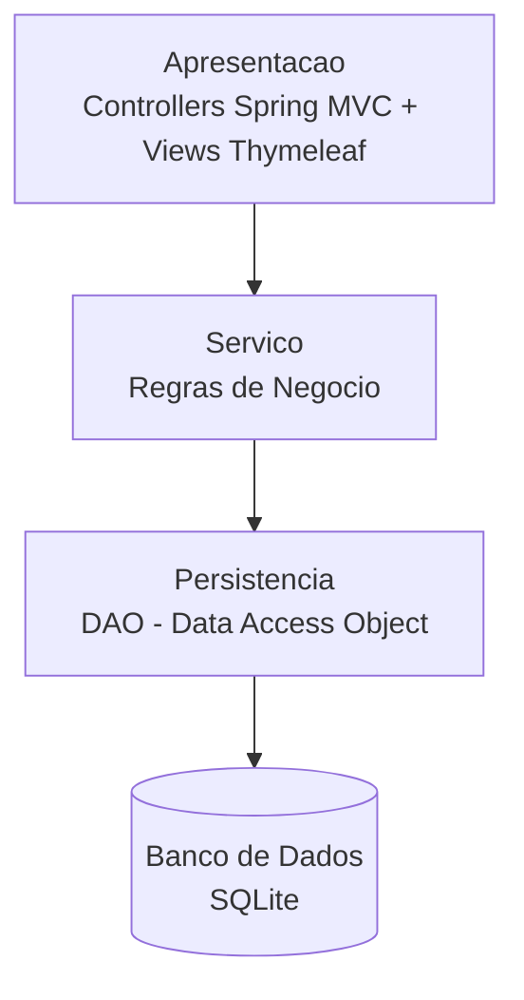
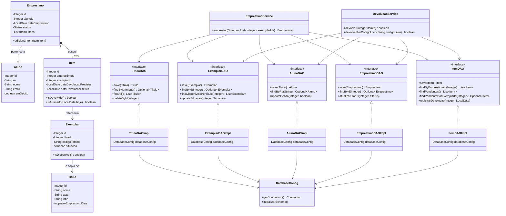
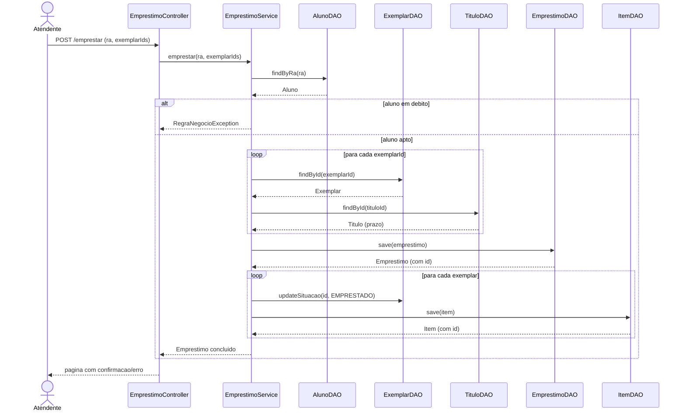
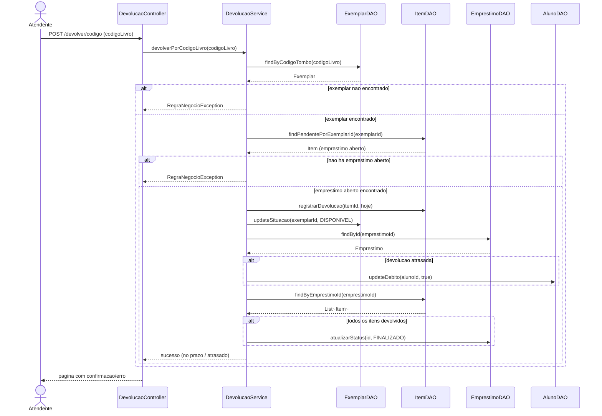
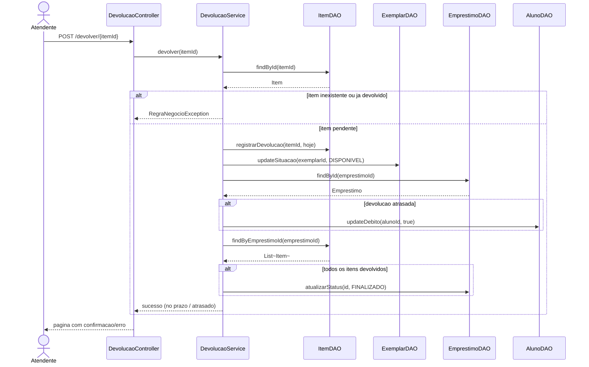

# Documentacao da Arquitetura — Sistema de Biblioteca

## 1. Visao Conceitual da Arquitetura

O sistema segue uma **arquitetura em camadas (Layered Architecture)**, na qual
cada camada so se comunica com a camada imediatamente abaixo dela. Isso isola
a interface do usuario das regras de negocio, e as regras de negocio da forma
como os dados sao persistidos.

- **Apresentacao (GUI web)**: recebe as requisicoes do usuario (formularios
  HTML/Thymeleaf) e delega para a camada de servico. Nao contem regra de
  negocio.
- **Servico**: implementa as regras de negocio dos casos de uso (ex:
  verificar se o aluno esta em debito antes de autorizar um emprestimo).
- **Persistencia (DAO)**: unico ponto do sistema que sabe falar com o banco
  de dados. As camadas acima dependem apenas das *interfaces* DAO, nunca da
  implementacao JDBC concreta.

## 2. Descricao dos Elementos da Arquitetura e Dependencias

| Camada | Pacote | Elementos | Depende de |
|---|---|---|---|
| Apresentacao | `com.biblioteca.controller` | `HomeController`, `LivroController`, `AlunoController`, `EmprestimoController`, `DevolucaoController` | Camada de Servico |
| Servico | `com.biblioteca.service` | `CatalogoService`, `AlunoService`, `EmprestimoService`, `DevolucaoService` | Interfaces DAO |
| Persistencia | `com.biblioteca.dao` | `TituloDAO`/`TituloDAOImpl`, `ExemplarDAO`/`ExemplarDAOImpl`, `AlunoDAO`/`AlunoDAOImpl`, `EmprestimoDAO`/`EmprestimoDAOImpl`, `ItemDAO`/`ItemDAOImpl` | `DatabaseConfig` (conexao JDBC) |
| Dominio | `com.biblioteca.model` | `Titulo`, `Exemplar`, `Aluno`, `Emprestimo`, `Item` | — (POJOs puros, sem dependencia de framework) |
| Infraestrutura | `com.biblioteca.config` | `DatabaseConfig` | Driver JDBC do SQLite |

A camada de **Controller** nunca acessa um DAO diretamente: ela sempre passa
por um `Service`. Isso garante que toda regra de negocio (ex: nao permitir
emprestimo para aluno em debito) fique centralizada e nao seja duplicada ou
burlada por uma tela que "esqueceu" de validar algo.

## 3. Padroes Arquiteturais

- **Arquitetura em Camadas (Layered Architecture)**: escolhida por ser simples
  de entender e implementar no prazo do trabalho, alem de deixar explicita a
  separacao entre interface, regra de negocio e persistencia — requisito
  central do projeto.
- **MVC (Model-View-Controller)**: usado dentro da camada de apresentacao.
  Os `Controllers` do Spring MVC recebem a requisicao, chamam o `Model`
  (representado aqui pelos Services/entidades) e selecionam a `View`
  (templates Thymeleaf) que sera renderizada.
- **DAO (Data Access Object)**: obrigatorio pelo enunciado do trabalho. Cada
  entidade de dominio possui uma interface DAO (contrato) e uma implementacao
  concreta (`*DAOImpl`) que usa JDBC puro sobre SQLite. Isso permite trocar o
  SGBD no futuro (ex: de SQLite para PostgreSQL) alterando apenas as classes
  `*DAOImpl`, sem tocar em `Service` ou `Controller`.

## 4. Diagrama de Classes

O diagrama abaixo cobre o modelo de dominio e a camada de persistencia (com o
padrao DAO ja aplicado), cobrindo os Casos de Uso **Emprestar Livro** e
**Devolver Livro**.

## 5. Casos de Uso

### 5.1 Caso de Uso: Emprestar Livro

- **Ator principal**: Aluno (atendido por um atendente/bibliotecario no
  balcao, via sistema).
- **Pre-condicoes**: aluno cadastrado; exemplares cadastrados e disponiveis.
- **Fluxo principal**:
  1. O atendente informa o RA do aluno e seleciona os exemplares desejados.
  2. O sistema verifica se o aluno existe.
  3. O sistema verifica se o aluno esta em situacao de debito.
  4. O sistema verifica se cada exemplar selecionado esta disponivel.
  5. O sistema calcula a data de devolucao prevista, com base no prazo do
     titulo de cada exemplar (o prazo e estendido em 2 dias para cada
     exemplar alem do segundo, incentivando devolucoes parciais).
  6. O sistema registra o emprestimo e marca os exemplares como `EMPRESTADO`.
  7. O sistema exibe a confirmacao com a data de devolucao.
- **Fluxos de excecao**:
  - Aluno inexistente → sistema informa o erro e nao realiza o emprestimo.
  - Aluno em debito → emprestimo recusado.
  - Exemplar indisponivel → emprestimo recusado.

### 5.2 Caso de Uso: Devolver Livro

- **Ator principal**: Aluno (atendido por um atendente/bibliotecario no
  balcao, via sistema).
- **Pre-condicoes**: existe um exemplar cadastrado e um emprestimo aberto
  (item ainda nao devolvido) associado a ele.
- **Fluxo principal (por codigo do livro)**:
  1. O atendente informa o codigo do livro (codigo de tombo do exemplar)
     no formulario de devolucao.
  2. O sistema busca o exemplar correspondente ao codigo informado.
  3. O sistema busca o emprestimo aberto (item sem devolucao) associado a
     esse exemplar.
  4. O sistema registra a data efetiva de devolucao no item do emprestimo.
  5. O sistema marca o item do emprestimo como devolvido e o exemplar
     correspondente volta a ficar `DISPONIVEL`.
  6. Se a devolucao ocorreu apos a data prevista, o sistema marca o aluno
     como em situacao de `debito`.
  7. Se todos os itens do emprestimo ja tiverem sido devolvidos, o
     emprestimo e encerrado, sendo marcado como `FINALIZADO`.
- **Fluxo alternativo (por item da lista)**: o atendente tambem pode
  selecionar diretamente, na lista de itens pendentes, o item a ser
  devolvido (util quando o codigo do livro nao esta em maos); a partir
  do passo 4 o fluxo e identico.
- **Fluxos de excecao**:
  - Codigo de livro nao corresponde a nenhum exemplar cadastrado → o
    sistema informa o erro e nao realiza a devolucao.
  - Nao ha emprestimo em aberto para o exemplar informado (livro nao
    emprestado ou ja devolvido) → o sistema informa o erro e nao realiza
    a devolucao.
  - Item selecionado na lista ja foi devolvido anteriormente → o sistema
    informa o erro.

## 6. Diagramas de Sequencia

### 6.1 Emprestar Livro

### 6.2 Devolver Livro (por codigo do livro)

### 6.3 Devolver Livro (fluxo alternativo, por item da lista)

## 7. Persistencia de Dados (Padrao DAO)

Toda a persistencia usa **JDBC puro** contra um arquivo **SQLite**
(`biblioteca.db`), atraves do padrao DAO:

- Cada entidade de dominio (`Titulo`, `Exemplar`, `Aluno`, `Emprestimo`,
  `Item`) possui uma interface DAO que declara o contrato de acesso a dados
  (`save`, `findById`, `findAll`, etc.), e uma implementacao concreta
  (`*DAOImpl`) anotada com `@Repository`.
- Os Services dependem apenas das interfaces DAO (injecao de dependencia via
  construtor), nunca das implementacoes concretas — isso e o que permite
  trocar a tecnologia de persistencia sem alterar a regra de negocio.
- O schema do banco (`titulo`, `exemplar`, `aluno`, `emprestimo`, `item`) e
  criado automaticamente na inicializacao da aplicacao, em
  `DatabaseConfig.inicializarSchema()`.
